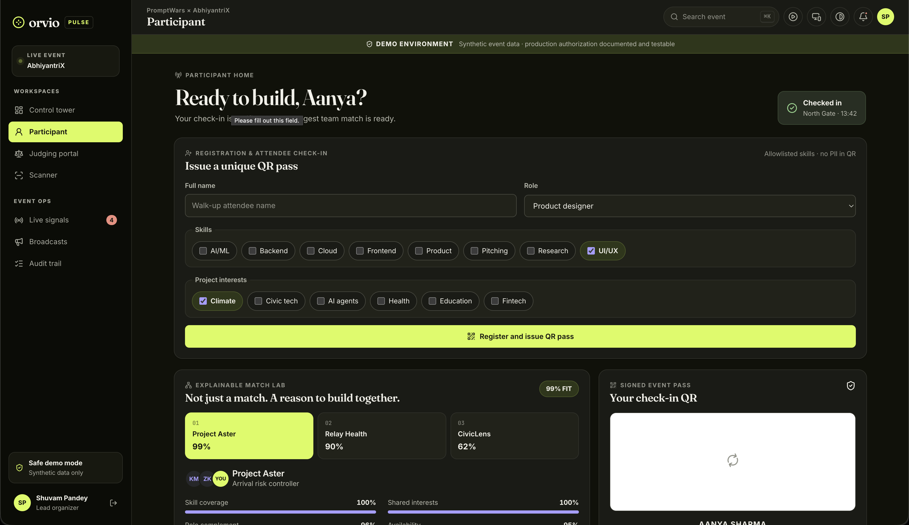

# Orvio Pulse

Event operations that see a break before it hits the floor.

Orvio Pulse is a four-role platform for live events. It runs registration and signed QR check-in, explainable team formation, broadcasts, structured judging, a live leaderboard, and organizer analytics. Event Pulse sits on that same operational picture and produces a recovery plan that only an organizer can approve.



## Demo path

1. **Participant** — register a walk-up attendee. A unique ticket UUID and signed QR pass are issued. Match Lab shows the fit components and a participant-controlled swap.
2. **Scanner** — disconnect, scan Aanya’s pass, reconnect. The queued scan verifies. Scan again and replay protection rejects the duplicate.
3. **Control tower → Recovery Engine** — choose a judge, gate, or venue incident. Review the before/after metric. Approve the proposal.
4. **Judging portal** — score against the locked rubric, attach evidence, finalize. The leaderboard re-ranks immediately.

Synthetic demo data is labeled. Vertex AI is optional: the same recovery plan is returned with `source: "deterministic-fallback"` when a Google project is not configured.

Architecture, the multi-role flow, and UX wireframes are in
[docs/architecture.md](docs/architecture.md).

## Roles

| Workspace     | Path           |
| ------------- | -------------- |
| Control tower | `/`            |
| Participant   | `/participant` |
| Judge         | `/judge`       |
| Organizer     | `/organizer`   |
| Scanner       | `/scanner`     |

## Lifecycle

| Capability              | In product                                                          | In code                                                                       | Verified by                                        |
| ----------------------- | ------------------------------------------------------------------- | ----------------------------------------------------------------------------- | -------------------------------------------------- |
| Registration and QR     | Unique ticket UUID, signed pass, offline queue, duplicate rejection | `registerAttendee`, `POST /api/registration`, `issueQrToken`, `recordCheckIn` | XSS, taxonomy, tamper, event-boundary, PII, replay |
| Team formation          | Ranked teams, fit meters, reasons, skill gaps, structured swap      | 35 / 25 / 20 / 10 / 10 model in `matching.ts`                                 | Range, rank, explanation, capacity                 |
| Broadcasts              | Live feed; recovery approval publishes the announcement             | Scoped announcements; sanitized composer                                      | Golden-path demo                                   |
| Judging                 | Locked rubric, evidence, immutable finalize                         | Weighted `judging.ts`; Firestore role rules                                   | Rubric math, deny-by-default rules                 |
| Leaderboard & analytics | Live re-rank after finalize; attendance and judging progress        | `applyPublishedScore`, `rankPublishedScores`, `analytics.ts`                  | Re-rank, clamp, O(1) snapshot                      |
| Recovery                | Incident simulation, truthful projection, human approval            | `pulse.ts`; Gemini rewrites copy only                                         | Thresholds, draft-until-approve                    |

## Architecture

```
src/lib/domain   match, pulse, judging, registration, ranking, sanitization
src/lib/server   QR signing, origin guards, Firebase Auth, Firestore, rate limits
src/app/api      Zod contracts, Cache-Control: no-store, role-gated handlers
```

Business rules are plain TypeScript, separate from React and Google Cloud. Route handlers stay small. Demo mode is labeled and scoped to `abhiyantrix-2026`; cloud mode verifies Firebase ID tokens and role claims.

## Google Cloud

Five services on the critical path. Full file map: [GOOGLE_SERVICES.md](GOOGLE_SERVICES.md).

| Service                         | Role                                                                |
| ------------------------------- | ------------------------------------------------------------------- |
| Cloud Run                       | App Router, role UIs, JSON APIs; scale-to-zero, 512 MiB, max 3      |
| Cloud Firestore                 | Atomic check-in + nonce replay lock, immutable scores, audit logs   |
| Firebase Authentication         | ID tokens and `role` claims on every mutating API                   |
| Vertex AI Gemini                | Recovery copy against a JSON schema; cannot invent numbers or state |
| Cloud Build + Artifact Registry | Reproducible image → digest → Cloud Run                             |

## Security

See [SECURITY.md](SECURITY.md).

QR passes are HS256, audience `orvio-check-in`, eight-hour expiry, ticket UUID + nonce only — no name, email, or phone. Firestore records the ticket and nonce in one transaction. Mutating APIs require a same-origin `Origin` header, cap JSON at 8 KB, and sanitize attendee-authored text. Production headers include a nonce CSP, `X-Content-Type-Options`, frame denial, Referrer-Policy, Permissions-Policy, HSTS, COOP, and CORP. The image runs as non-root `nextjs` (UID 1001). Error boundaries never render stack traces.

## Quality

Strict TypeScript (`forceConsistentCasingInFileNames`, `noFallthroughCasesInSwitch`). ESLint with `eqeqeq`, `no-var`, `prefer-const`, `no-console`, `no-duplicate-imports`, zero warnings. Prettier, `.editorconfig`, `.gitattributes`, JSDoc on exported domain and server functions. 404, loading, and error UI. CI: format, lint, typecheck, coverage, Firestore rules, production build, Playwright.

**Tests.** 65 Vitest cases: matching, pulse thresholds, rubric math, token tamper / expiry / event isolation, replay, origin / CSRF, XSS, registration, analytics, rate limits, recovery fallbacks. Coverage gates: 80% statements and lines, 60% branches, 95% functions. Seven emulator-backed Firestore rules cases. Playwright covers the multi-role demo on desktop and mobile; axe-core runs on every principal screen.

**Accessibility.** WCAG 2.1 AA: `lang`, skip link, landmarks, visible `:focus-visible`, `aria-live` status, `role="meter"` fit bars, a captioned leaderboard `<table>`, high-contrast mode (`aria-pressed`), `prefers-reduced-motion`, `prefers-contrast`, and `forced-colors`.

Matching, ranking, and analytics are linear in the active event slice. Leaderboard totals update from published scores. Cloud Run: `--min-instances=0`, `--memory=512Mi`, concurrency 80.

## Run locally

Node.js 24 (see `.nvmrc`).

```bash
npm ci
cp .env.example .env.local
# openssl rand -base64 32  →  QR_SIGNING_SECRET
npm run dev
```

http://localhost:3000

```bash
npm run verify
npx firebase emulators:exec --only firestore "npm run test:rules"
npx playwright install chromium
npm run test:e2e
```

## Deploy

Production host is Cloud Run.

```bash
gcloud config set project YOUR_PROJECT_ID
gcloud services enable run.googleapis.com cloudbuild.googleapis.com artifactregistry.googleapis.com firestore.googleapis.com aiplatform.googleapis.com
gcloud artifacts repositories create orvio --repository-format=docker --location=asia-south1
printf '%s' "$(openssl rand -base64 32)" | gcloud secrets create qr-signing-secret --data-file=-
gcloud builds submit --config cloudbuild.yaml --substitutions=COMMIT_SHA="$(git rev-parse HEAD)"
```

Mount `QR_SIGNING_SECRET` from Secret Manager. Grant the Cloud Run identity `roles/aiplatform.user` and the minimum Firestore role. Deploy `firestore.rules`. Confirm `/api/healthz`.

## License

MIT. See [LICENSE](LICENSE).
