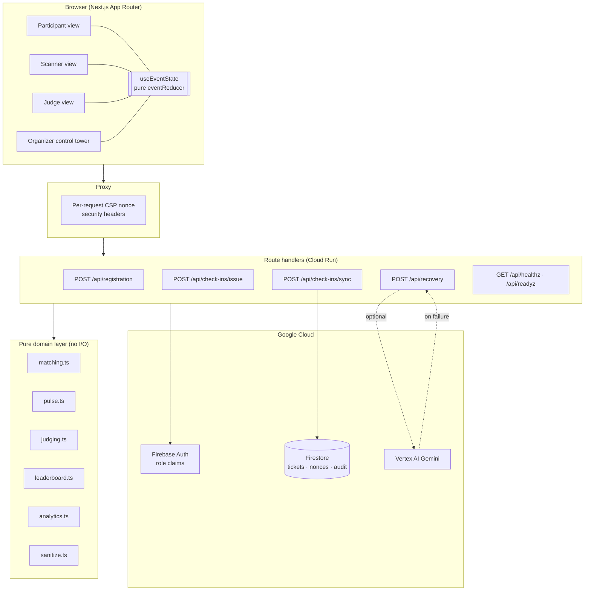
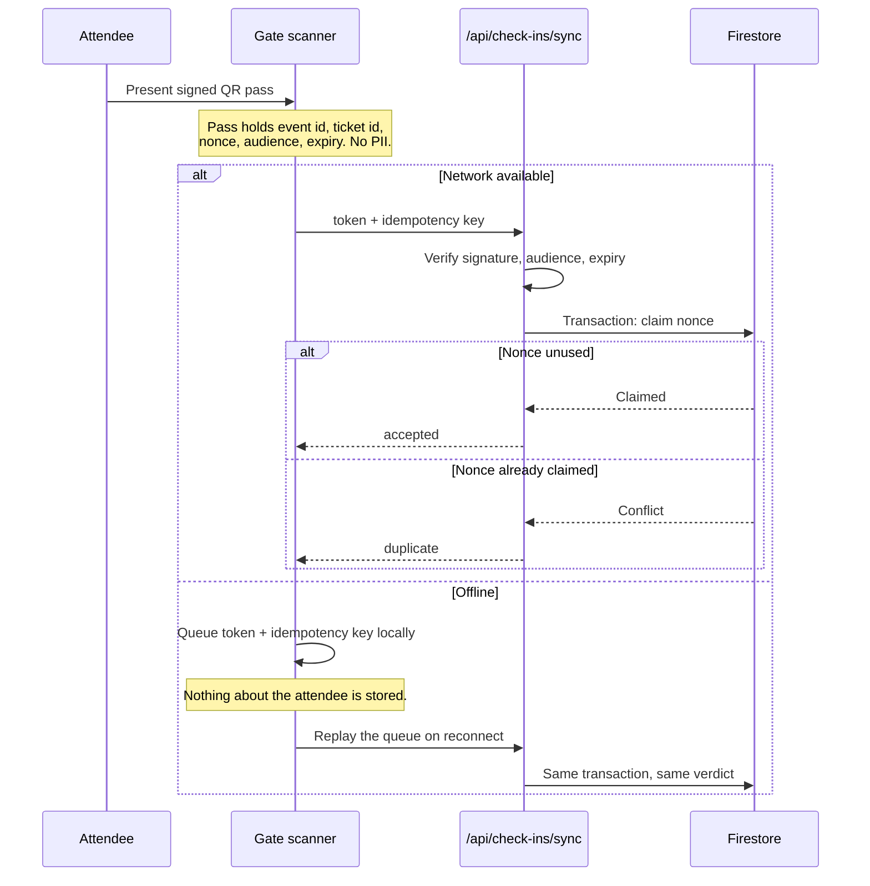
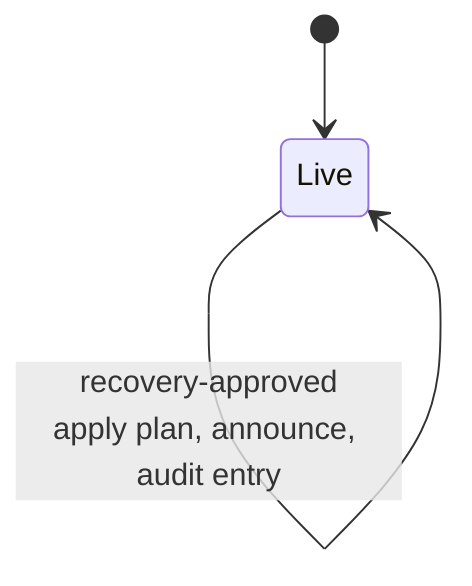

# Architecture and multi-role flow

This document covers the two named design deliverables: the system
architecture, and the UX wireframes for the participant, judge, and organizer
flows. Every diagram describes code that exists in this repository.

## 1. Roles and what each one is allowed to do

Four workspaces share one live event slice. Authority is deliberately
asymmetric: the views that display consequential numbers cannot change them.

| Role         | Route            | Can do                                                              | Cannot do                                                 |
| ------------ | ---------------- | ------------------------------------------------------------------- | --------------------------------------------------------- |
| Participant  | `/participant`   | Register, hold a signed pass, browse ranked teams, request to join  | Assign itself to a team, read another attendee's ticket   |
| Gate scanner | `/scanner`       | Present a pass for verification, queue scans offline                | Decide whether a scan counts; the server transaction does |
| Judge        | `/judge`         | Score against a locked rubric, attach evidence, finalize once       | Edit a finalized score, see another judge's draft         |
| Organizer    | `/` `/organizer` | Broadcast, simulate an incident, approve a recovery, read analytics | Alter a published score, write the audit trail by hand    |

## 2. System architecture



Two properties are worth stating explicitly, because they are what the code is
organised around:

- **The domain layer performs no I/O.** `matching`, `pulse`, `judging`,
  `leaderboard`, `analytics`, and `sanitize` are pure functions over plain
  data. That is why they are cheap to test exhaustively.
- **Gemini is never on the critical path.** If Vertex AI is unavailable or no
  Google project is configured, `/api/recovery` returns the deterministic
  projection with `source: "deterministic-fallback"`. The demo cannot fail
  because a model call failed, and the UI labels which one it got.

## 3. Check-in: the one flow that has to survive a bad network



The scanner never decides the outcome. Whether a scan arrives immediately or an
hour later, one Firestore transaction claims the nonce, so a replayed pass is
rejected on the second attempt and attendance cannot be inflated.

## 4. UX wireframes

### Organizer — control tower

```text
┌ Sidebar ───────────┬ Control tower ─────────────────────────────────────────┐
│ orvio  PULSE       │ PromptWars x AbhiyantriX      [search ⌘K] [theme] [a11y]│
│ ● LIVE AbhiyantriX ├─────────────────────────────────────────────────────────┤
│                    │ Good afternoon, Shuvam.     [Demo guide] [Simulate]     │
│ WORKSPACES         │ Orvio found 3 risks that need attention.                │
│ ▸ Control tower    ├───────────┬───────────┬───────────┬───────────┐         │
│   Participant      │ Checked in│ Team ready│ Judging   │ Reach     │         │
│   Judging portal   │ 438 / 512 │ 451       │ 68 %      │ 58 %      │         │
│   Scanner          │ ▁▂▄▅▆▇    │ ▁▃▄▅▆▇    │ ▁▂▃▅▆▇    │ ▁▄▆▇▇▇    │         │
│                    ├───────────┴───────────┴─┬─────────┴───────────┘         │
│ EVENT OPS          │ EVENT PULSE             │ INCIDENT DESK                 │
│   Live signals  4  │ What is about to break? │ Model a disruption before     │
│   Broadcasts       │ ┌─────────┬───────────┐ │ it reaches attendees.         │
│   Analytics        │ │Gate     │Team cutoff│ │ [Judge][Gate][Venue]          │
│   Audit trail      │ │26 vs 20 │61 · 24 min│ │ [Run selected scenario]       │
│                    │ ├─────────┼───────────┤ ├───────────────────────────────┤
│ ┌ Safe demo mode ┐ │ │Judging  │Reach 58%  │ │ IMMUTABLE AUDIT TRAIL         │
│ │ Synthetic only │ │ └─────────┴───────────┘ │ QR verified · 14:07           │
│ └────────────────┘ ├─────────────────────────┴───────────────────────────────┤
│ SP Shuvam Pandey   │ LIVE LEADERBOARD  01 Project Aster … 92.4               │
└────────────────────┴─────────────────────────────────────────────────────────┘
```

### Participant — registration, Match Lab, signed pass

```text
┌ Ready to build, Shuvam?                         ┌ Checked in ─────────┐      │
│                                                 │ North Gate · 13:42  │      │
├ REGISTRATION & ATTENDEE CHECK-IN ───────────────┴─────────────────────┴──────┤
│ Full name [________]   Role [Product designer ▾]                             │
│ Skills    ( AI/ML )( Backend )( Cloud )( ✓ UI/UX )      ← fixed allowlist    │
│ Interests ( ✓ Climate )( Civic tech )( AI agents )                           │
│ [ Register and issue QR pass ]                                               │
├ EXPLAINABLE MATCH LAB ─────────────────────────┬ SIGNED EVENT PASS ──────────┤
│ [01 Project Aster 99%][02 Relay 90%][03 …62%]  │      ▓▓░▓░▓▓                │
│ KM ZK YOU  Project Aster                       │      ░▓▓░▓░░   ← no PII     │
│ Skill coverage   ▓▓▓▓▓▓▓▓ 100%                 │      ▓░▓▓░▓▓                │
│ Shared interests ▓▓▓▓▓▓▓▓ 100%                 │  SHUVAM PANDEY              │
│ Role complement  ▓▓▓▓▓▓▓░  96%                 │  Ticket ••••1042            │
│ Availability     ▓▓▓▓▓▓▓░  95%                 │  Signed · replay protected  │
│ ✓ Why this match works                         ├ LIVE UPDATES ───────────────┤
│   UI/UX + Research closes a capability gap     │ ⚠ Judging starts at 17:00   │
│ [Request structured swap] [Ask to join →]      │ ▣ Workshop room changed     │
└────────────────────────────────────────────────┴─────────────────────────────┘
```

### Judge — locked rubric and one-way finalize

```text
┌ Review Project Aster ───────────────────────────────────┬ 84 / 100 ──────────┐
│ private draft · conflict check passed · rubric v3 locked└────────────────────┤
├ SUBMISSION 04 ──────────────────┬ STRUCTURED RUBRIC · V3 ────────── ✓ Saved ─┤
│ Project Aster                   │ Functionality   30%   6 7 [8] 9 10         │
│ A queue-risk controller…        │ Innovation      25%   6 7  8 [9] 10        │
│ ( Event ops )( Cloud Run )      │ Practical impact20%   6 7 [8] 9 10         │
│ ┌───────────────────────────┐   │ Google tools    15%   6 7  8 [9] 10        │
│ │   Evidence bundle ready   │   │ Presentation    10%   6 7 [8] 9 10         │
│ │ [Review submitted evidence]│  ├─────────────────────────────────────────────┤
│ └───────────────────────────┘   │ Evidence-linked feedback [____________]    │
│ ✓ Evidence integrity            │ ⚖ FairScore lens — advisory only           │
│   read-only · no fabricated     │ [ Finalize 84/100 ]  ← one way             │
│   deployment claim              │                                            │
└─────────────────────────────────┴────────────────────────────────────────────┘
```

### Scanner — offline-tolerant gate

```text
┌ Fast check-in. Safe under pressure.        [ ⦿ Online / ⦸ Offline mode ]     │
├────────────────────────────────────────┬─────────────────────────────────────┤
│  ┌ ─ ─ ─ ─ ─ ─ ─ ─ ─ ─ ─ ─ ─ ─ ─ ─ ┐   │ GATE PULSE        ● Action needed   │
│  ╷                                 ╷   │ 20 people/min                       │
│  ╷          [ QR frame ]           ╷   │ 26 arriving. ▓▓▓▓▓▓▓░░░             │
│  ╷        Ready to scan            ╷   ├─────────────────────────────────────┤
│  ╷                                 ╷   │ ✓ PRIVACY BY DESIGN                 │
│  └ ─ ─ ─ ─ ─ ─ ─ ─ ─ ─ ─ ─ ─ ─ ─ ─┘   │ event id, ticket id, nonce, expiry  │
│      [ Scan the signed demo pass ]     │ never a name, email, or phone       │
│           Reset scanner view           ├─────────────────────────────────────┤
│                                        │ OFFLINE QUEUE                  0    │
│  States: accepted · duplicate ·        │ No pending scans. Disconnect to     │
│          queued · invalid              │ demonstrate resilient check-in.     │
└────────────────────────────────────────┴─────────────────────────────────────┘
```

## 5. State: one reducer, one audit trail

Every consequential change goes through `eventReducer` in
`src/lib/domain/event-state.ts`. There are exactly four such changes:



The reducer is pure. Identity and timestamps are supplied by the caller, which
is what makes each transition reproducible in a test. Because the audit entry
is written by the same branch that changes the numbers, the log and the state
cannot drift apart.

## 6. Where each challenge requirement lives

| Requirement                    | Code                                                                                      |
| ------------------------------ | ----------------------------------------------------------------------------------------- |
| Registration and QR check-in   | `domain/registration.ts`, `api/registration`, `server/qr.ts`, `server/check-in-store.ts`  |
| Smart team formation           | `domain/matching.ts`, `views/participant/match-lab.tsx`                                   |
| Broadcast centre               | `views/organizer/broadcast-workspace.tsx`, `domain/sanitize.ts`                           |
| Interactive judging portal     | `domain/judging.ts`, `views/judge/judge-view.tsx`                                         |
| Live leaderboard and analytics | `domain/leaderboard.ts`, `domain/analytics.ts`, `views/organizer/analytics-workspace.tsx` |
| Multi-role flow                | `components/orvio-app.tsx`, `components/shell/`                                           |
