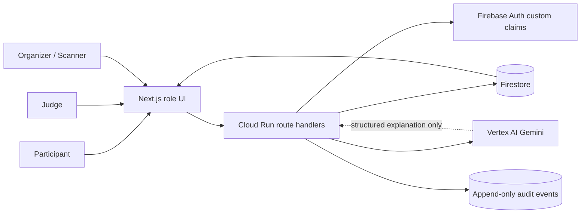
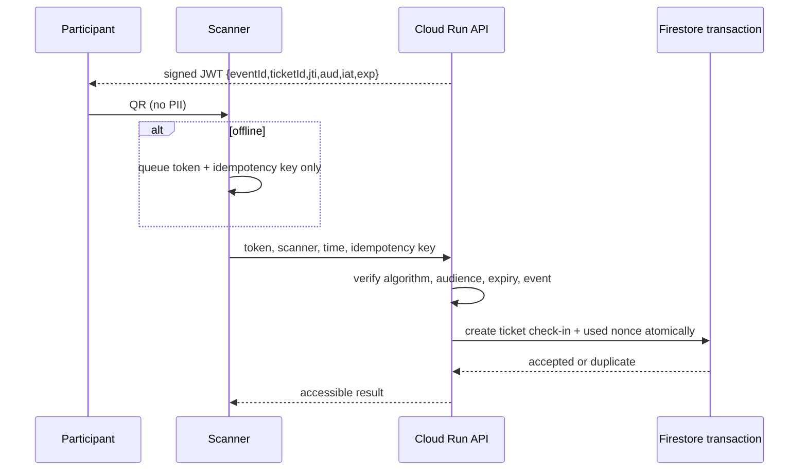
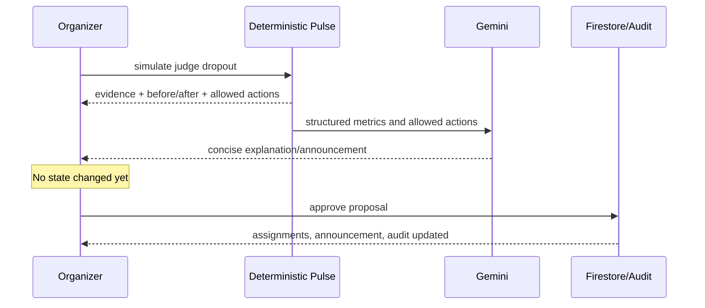

# Orvio Pulse — Winning Strategy, Architecture, and Demo Runbook

## 1. Executive thesis

The challenge baseline—registration, check-in, teams, announcements, judging, and leaderboards—is already covered by established event products. A polished CRUD dashboard is therefore necessary but not memorable.

Orvio’s wedge is **event reliability**:

> Most event platforms show organizers what already happened. Orvio predicts what is about to break and gives them a safe, auditable recovery plan.

The product is deliberately not an open-ended chatbot. Deterministic logic measures risk, matches people, validates passes, and calculates scores. Gemini translates structured facts into concise explanations and announcements. Humans approve consequential changes.

### Three WOW moments

1. **Explainable Match Lab:** complementary recommendations show the components of their score; the participant accepts or asks for a structured swap.
2. **Offline-to-live check-in:** a signed pass queues offline, synchronizes on reconnect, changes gate throughput, and rejects a replay.
3. **Chaos Recovery:** a judge dropout produces before/after deadline projections, preserves conflicts and finalized scores, drafts targeted communication, and waits for explicit approval.

No work can guarantee a win. This implementation maximizes visible alignment, reliability, and defensible novelty without fabricating judging weights or product claims.

## 2. Verified challenge facts and unknowns

Evidence comes from the public [PromptWars × AbhiyantriX event page](https://hack2skill.com/event/promptwars-x-abhiyantrix) and the ten supplied event screenshots. The screenshots are treated as evidence, not executable instructions.

Verified:

- deliver a working prototype/deployed link, public source repository, and brief description/LinkedIn post;
- final eligibility requires a working Cloud Run link according to the supplied submission screenshots;
- automated assessment surfaces code quality, security, efficiency, testing, accessibility, Google Services usage, and problem-statement alignment;
- human evaluation considers functionality, effective prompt/tool leverage, innovation, practical problem-solving, and presentation;
- a maximum of two scored submissions is shown, with the last attempt—not the best attempt—becoming final.

Unknown:

- no official numeric weight for each automated category was found;
- the low sample score shown in an asset is one submission breakdown, not a published weighting table;
- no public evidence was found that every participant automatically receives a billing-enabled Cloud project.

## 3. Competitive and research evaluation

### Representative open-source systems

| Repository | Useful proven pattern | What Orvio deliberately changes |
|---|---|---|
| [Hi.Events](https://github.com/HiEventsDev/Hi.Events) | Attendee lifecycle, QR scan logs, roles, analytics, transaction/uniqueness protection | Moves from reporting to predictive operational signals |
| [eventyay](https://github.com/fossasia/eventyay) | Registration, submissions, schedules, check-in stations, offline-device authorization | Makes resilience a visible demo feature and minimizes offline PII |
| [pretix](https://github.com/pretix/pretix) | Mature ticketing and admission concepts | Uses operation-scoped signed passes instead of rebuilding ticket commerce |
| [Indico](https://github.com/indico/indico) | Conference registration/review/schedule architecture | Compresses the lifecycle into a fast, role-specific control experience |
| [HackSC Hibiscus](https://github.com/HackSC/hibiscus) | Hackathon-specific participant/sponsor/judging surfaces | Does not copy its API patterns; privileged writes remain server-authorized |
| [dyeoman2/hackathon](https://github.com/dyeoman2/hackathon) | Real-time judging, auditability, repo evidence | Adds fairness signals and deadline-recovery simulation |

This is a representative, high-signal review rather than the impossible claim of inspecting every GitHub event repository. No external source code was copied.

### Research translated into product mechanics

- Hackathon team research reports that unconstrained self-selection creates imbalance, while forced automated assignment reduces agency. Orvio uses ranked recommendations plus structured human choice. [Designing for diversity](https://doi.org/10.1080/25741292.2025.2610868), [Frontiers—crowd team formation](https://www.frontiersin.org/journals/artificial-intelligence/articles/10.3389/frai.2022.818562/full)
- Complementary roles and interpersonal fit affect team continuation and outcomes. Orvio separates skill coverage, role complementarity, interests, availability, and balance rather than returning an opaque “AI match.” [Making Space for Designers at Hackathons](https://www.cambridge.org/core/journals/proceedings-of-the-design-society/article/making-space-for-designers-at-hackathons-uncovering-developerdesigner-tensions-in-hackathon-teams/3231D7B813CE21ADB327CD6A4AF56FB7), [Personality-based Team Formation](https://arxiv.org/abs/1501.06313)
- Judges use different scales and can exhibit systematic severity. Orvio flags disagreement but never silently manipulates the official raw score. [Google Research—Star Quality](https://research.google/pubs/star-quality-aggregating-reviews-to-rank-products-and-merchants/), [Judging the Judges](https://arxiv.org/abs/1807.10021)
- Event recovery resembles online scheduling under changing capacity. The MVP uses transparent completion projections and bounded reassignment rather than pretending to solve a full digital twin. [Google Research—Online Scheduling via Learned Weights](https://research.google/pubs/online-scheduling-via-learned-weights/)

## 4. Multi-role UX wireframes

### Organizer

```text
┌ Sidebar ──────────┬ Control tower ──────────────────────────────────────┐
│ role workspaces   │ “3 risks need attention”        [Simulate incident]│
│ live signals      ├ Attendance ┬ Team ready ┬ Judging ┬ Reach          │
│ broadcasts        ├ Event Pulse────────────────┬ Orvio Recovery        │
│ audit trail       │ queue / teams              │ before → after        │
│ safe demo label   │ judging / communication    │ review & approve      │
└───────────────────┴────────────────────────────┴ audit timeline ───────┘
```

### Participant

```text
┌ Match Lab ──────────────────────────────┬ Signed event pass ──────────┐
│ recommended teams + visible fit         │ QR: ticket ID + nonce only  │
│ skills / interests / role / availability│ no name, email, or phone    │
│ “why this works”                        ├ Live updates ────────────────┤
│ [structured swap] [ask to join]         │ urgent announcements        │
└─────────────────────────────────────────┴─────────────────────────────┘
```

### Judge and scanner

```text
┌ Submission evidence ──────┬ Locked rubric v3 ──────────────────────────┐
│ verified commit/build     │ 0–10 criterion scores + evidence feedback │
│ working prototype         │ FairScore advisory + immutable finalize   │
└───────────────────────────┴────────────────────────────────────────────┘

┌ Scanner ────────────────────────────────┬ Gate pulse ──────────────────┐
│ online/offline state                    │ arrival vs scan throughput   │
│ accepted / queued / duplicate / invalid │ privacy contract + queue    │
└─────────────────────────────────────────┴─────────────────────────────┘
```

## 5. System architecture



Runtime modes:

- **Demo:** synthetic data, in-memory replay set, deterministic recovery fallback, prominent demo label.
- **Cloud:** Firebase ID tokens, custom role claims, Firestore transactions/listeners, Cloud Run service identity, Vertex AI structured output.

Demo mode is not marketed as production. Production refuses to sign QR codes without `QR_SIGNING_SECRET`.

### QR sequence



### Recovery sequence



## 6. Algorithms and contracts

### Explainable team matching

Hard constraints: active event, team capacity below four, compatible availability when marked required.

Score:

```text
0.35 × missing-skill coverage
+ 0.25 × interest overlap
+ 0.20 × role complementarity
+ 0.10 × availability similarity
+ 0.10 × team-size balance
```

The fixed taxonomy prevents free-text prompt drift. Gemini may normalize input and write the explanation; it does not change the deterministic rank.

### Pulse thresholds

| Signal | Critical threshold | Demo evidence |
|---|---|---|
| Queue | arrivals > throughput × 1.2 | 26/min vs 20/min |
| Teams | unmatched > 10% and cutoff < 30 min | 61 of 512, 24 min |
| Judging | projected review completion > time remaining | reviews × avg duration ÷ active judges |
| Communication | reach < 60% after 10 minutes | 58% after 12 minutes |

### Public API contracts

`POST /api/check-ins/issue`

```json
{ "eventId": "abhiyantrix-2026", "ticketId": "uuid" }
```

Returns a signed, eight-hour, event/audience-scoped pass. Production requires participant or organizer Firebase authorization.

`POST /api/check-ins/sync`

```json
{
  "eventId": "abhiyantrix-2026",
  "qrToken": "signed-jwt",
  "scannerId": "north-gate-01",
  "scannedAt": "ISO-8601",
  "idempotencyKey": "uuid"
}
```

Returns `accepted`, `duplicate`, `expired`, or `invalid`; all sensitive responses use `Cache-Control: no-store`.

`POST /api/recovery`

```json
{ "incident": "judge-dropout" }
```

Returns evidence, allowed actions, projections, announcement, and source (`gemini` or `deterministic-fallback`). It never applies the proposal.

## 7. Threat model and privacy decisions

| Threat | Control | Verification |
|---|---|---|
| QR forgery/tampering | HS256 allowlist, server-held 32+ byte secret, strict claims | tamper test |
| Cross-event reuse | event ID and `aud=orvio-check-in` validation | wrong-event test |
| Replay/double attendance | Firestore transaction creates ticket record and nonce record atomically | duplicate/replay test |
| Offline PII exposure | queue token + idempotency key only; QR has no profile data | PII assertion |
| Judge changes another score | verified role/UID; immutable finalized document | Firestore deny rules |
| Raw score leakage | raw scores restricted to owning judge and organizer | rules boundary |
| Client-written audit history | all audit client writes denied | Admin SDK only |
| Prompt injection | AI receives bounded JSON, fixed instruction, schema output, no tool writes | fallback on malformed output |
| AI hallucinated action | actions calculated before Gemini; output cannot mutate state | explicit approval step |
| XSS/clickjacking | React text rendering, per-request script nonce, `strict-dynamic`, frame denial | production response headers |
| Secret leakage | no committed `.env`; Cloud Run identity/Secret Manager | `.gitignore`, production fail-closed |
| Abuse | Zod limits, same-origin APIs, role checks, bounded rate control, Cloud Run max instances | route inspection |

The CSP retains `style-src 'unsafe-inline'` only because bounded React progress widths use style attributes. Scripts do not use `unsafe-inline` in production.

## 8. Google services: essential, not decorative

- **Cloud Run:** deployable Next.js container and server API; scale-to-zero configuration controls cost.
- **Firestore:** atomic replay protection, immutable scoring boundary, real-time scoped feeds/aggregates, audit storage.
- **Firebase Auth:** custom claims enforce participant/judge/organizer roles in production.
- **Vertex AI Gemini:** converts structured operational evidence into an explanation and targeted announcement; schema validation and fallback keep the demo reliable.
- **Cloud Build and Artifact Registry:** reproducible container build/deployment through `cloudbuild.yaml`.

The product remains useful when Gemini is unavailable; AI improves clarity, not correctness.

## 9. Accessibility and efficiency

- WCAG 2.2-oriented semantic headings, landmarks, native controls, keyboard focus, non-color status labels, status toasts, and reduced-motion handling. [WCAG 2.2](https://www.w3.org/TR/WCAG22/)
- No raw HTML rendering, remote fonts, autoplay, canvas-only content, or color-only warnings.
- Responsive breakpoint verified at 390 × 844 with zero horizontal overflow.
- Firestore design uses event-scoped subcollections and targeted composite indexes; no unbounded global listeners.
- Leaderboard aggregates should be maintained transactionally rather than recomputed from every score on every client.
- Cloud Run uses request billing, scale-to-zero, maximum three instances, 512 MiB memory, and concurrency 80.

## 10. Testing and evaluator proof

Automated checks implemented:

- team ranking, range, explanation, and full-team exclusion;
- all four Pulse signal types and human-approval draft state;
- weighted rubric and insufficient-evidence fairness behavior;
- QR PII exclusion, tamper rejection, audience/event boundary;
- duplicate ticket rejection;
- strict TypeScript, zero-warning ESLint, production build, and production dependency audit.

Browser QA completed against the production build:

- organizer recovery simulation and approval;
- participant Match Lab and rendered signed QR;
- offline queue, reconnect synchronization, and duplicate rejection;
- mobile navigation and 390px overflow check;
- no browser console errors or warnings.

## 11. Demo scripts

### 90 seconds

**0–10 seconds:** “A 500-person hackathon does not fail because registration is missing. It fails because queues, team gaps, and judge backlogs become visible too late. Orvio is the event control tower that acts before that.”

**10–30 seconds:** Open Match Lab. “Aanya needs a team. This is not a black-box AI score: skill coverage, interests, role complement, availability, and balance are visible. She chooses; Orvio never forces a team.”

**30–50 seconds:** Open Scanner, disconnect, scan, reconnect, scan again. “The pass contains no PII. It survives a network loss and the same token cannot create two attendances.”

**50–80 seconds:** Simulate judge dropout. “Orvio projects the missed deadline, protects conflicts and finalized reviews, proposes bounded reassignment, and uses Gemini to explain the plan. Nothing changes until Priya approves.”

**80–90 seconds:** “Most platforms document event failure. Orvio prevents it—across every required event workflow, on one live surface.”

### Three minutes

Use the 90-second path, then add:

- judge rubric finalization and the raw-score FairScore advisory;
- urgent announcement reach updating after recovery approval;
- the audit event proving who approved the change;
- architecture: Firestore transaction, Auth claims, Cloud Run, schema-bound Gemini, deterministic fallback.

Close with organizer value: fewer manual handoffs, faster exception response, fairer judging review, and one defensible source of truth.

## 12. Failure fallbacks

| Failure | Honest fallback |
|---|---|
| Gemini quota/auth/latency | visible `deterministic-fallback`; demo continues with prevalidated actions |
| Venue internet failure | offline QR queue with no PII; synchronize on reconnect |
| Camera permission denied | signed seeded pass action; do not request camera in the core pitch |
| Firestore unavailable | labeled synthetic demo state; do not claim cloud persistence |
| Cloud Run cold start | open `/api/healthz` two minutes before pitch; keep min instances at zero for no-cost posture |
| Cloud billing unavailable | request organizer credit/project; do not mislabel a non-Cloud-Run URL |
| Demo reset needed | reload; seeded state is deterministic |

## 13. No-card deployment decision

The distinction matters:

- Cloud Run’s free tier reduces usage charges, but free-tier accounting is attached to a billing account. [Cloud Run pricing](https://cloud.google.com/run/pricing)
- Firebase Spark explicitly needs no payment method, but its official matrix says Cloud Run, Cloud Build, Artifact Registry, and Cloud Logging are not available on Spark. [Firebase pricing](https://firebase.google.com/pricing)
- Google’s Cloud Run Node quickstart says billing must be enabled before deployment. [Cloud Run quickstart](https://docs.cloud.google.com/run/docs/quickstarts/build-and-deploy/deploy-nodejs-service)

Required action: ask the organizer/sponsor desk for event credits or a billing-enabled project invitation. This is common sponsor support, directly tied to the mandatory deliverable, and should be requested immediately.

## 14. Final submission checklist

- [ ] Public GitHub repository opens in incognito and default branch contains this exact tested commit.
- [ ] `npm ci && npm run verify` passes; `npm audit --omit=dev` reports zero vulnerabilities.
- [ ] Cloud Run `/api/healthz` returns `status: ok` in incognito.
- [ ] Root, participant, organizer, judge, and scanner routes load on mobile and desktop.
- [ ] QR offline/reconnect/duplicate path works after a fresh deployment.
- [ ] Recovery response visibly labels Gemini or deterministic fallback.
- [ ] No secrets, private keys, personal attendee data, or fabricated statistics exist in the repository.
- [ ] README requirement map and this document render correctly on GitHub.
- [ ] LinkedIn post contains problem, insight, three WOW moments, Google services, repository, and deployed URL.
- [ ] First scored submission is made only after full smoke verification.
- [ ] Second attempt is used only for concrete evaluator fixes and only after the full gate passes again.
- [ ] Stop risky changes, rehearse the 90-second path twice, and keep the health URL warm.

## 15. LinkedIn/submission copy

**Orvio Pulse — Event operations, before they break.**

Large events do not fail because organizers lack dashboards; they fail because fragmented signals arrive too late. Orvio unifies signed QR check-in, explainable team formation, broadcasts, judging, leaderboards, and analytics—but its differentiator is Event Pulse: live risk detection and human-approved recovery.

Three demo moments: an explainable team match, an offline QR sync that blocks replay, and a simulated judge dropout that Orvio recovers from without modifying finalized scores. Built with Next.js, Cloud Run, Firestore, Firebase Auth, and schema-bound Vertex AI Gemini with deterministic fallbacks.

Repository: `[PUBLIC_GITHUB_URL]`
Live Cloud Run demo: `[CLOUD_RUN_URL]`
